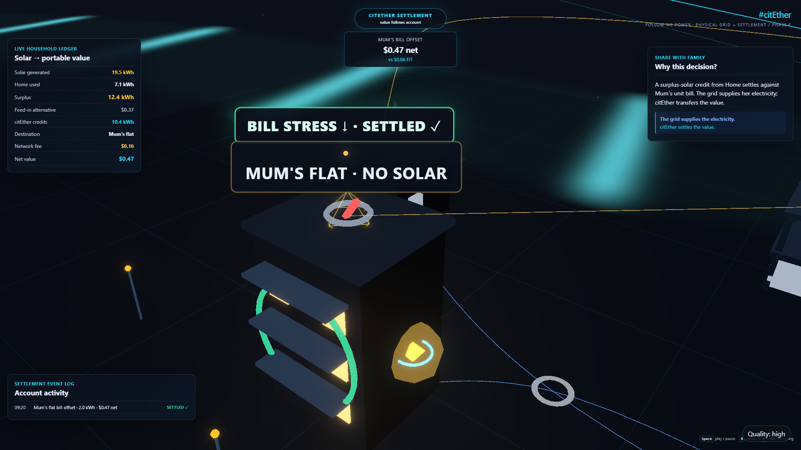
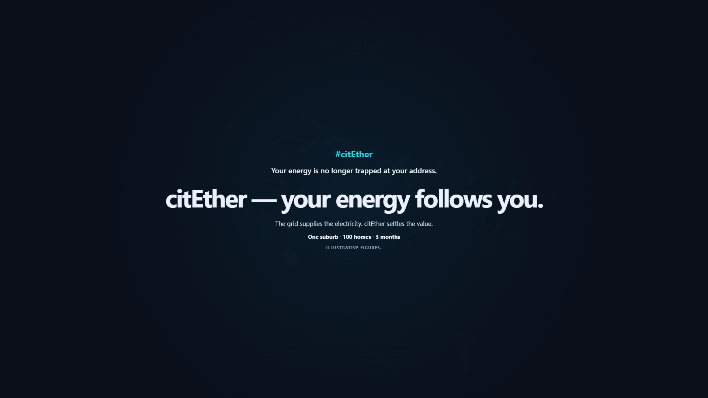
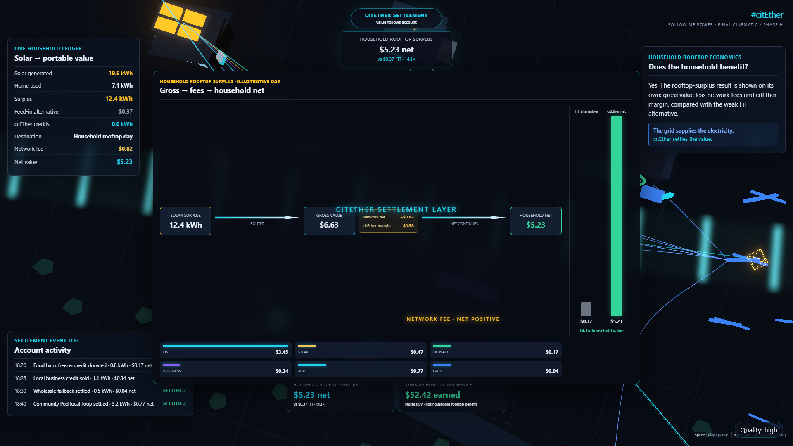

# citEther — Follow Me Power

**A real-time 3D simulation of location-independent energy settlement.**

🔗 **Live demo:** _coming soon_ — deploying… &nbsp;·&nbsp; ▶ **Watch with sound on** (click *“Start cinematic with narration”* — there's a synced voiceover).

> An independent concept project, built out after a hackathon. On-screen figures are
> **illustrative but internally consistent** — every number comes from a small deterministic
> economics model, not random values.

---

## What it is

Today, a home's rooftop-solar **value is trapped at the meter**. After the household uses
what it can and the battery is full, the surplus has only one option — export it to the grid
for a near-zero feed-in tariff. Meanwhile, the *same person* pays high prices for energy
**somewhere else**: charging an EV at the coast, running tools on a job site, helping a parent
across town.

**citEther adds a settlement layer.** That trapped surplus becomes **portable credits that
follow the person** and settle against the energy they consume at other locations. Crucially:

- **The grid still supplies the electricity** at every location.
- **citEther settles the *value*** — credits, not literal electrons moving across the country.
- Even after network fees and a platform margin, the net value **beats exporting for almost nothing**.

This repo is the explainer: a ~3:15 deterministic cinematic that teaches the idea in six stages
— *problem → contradiction → breakthrough → use cases → economics → thesis* — with a dual-layer
visual (physical grid vs. settlement credits), live ledger/event-log/Sankey overlays, and a warm
voiceover.

## Screenshots

| A use case (Mum's flat) | The closing thesis |
|---|---|
|  |  |

The economics beat shows the honest money math (gross → network fee → margin → net, vs. the weak feed-in alternative):



## Features

- **15-beat cinematic** driven by a single deterministic GSAP timeline (195s story + 5s end-card hold) — identical on every play, safe to screen-record.
- **Dual-layer visuals** that keep the concept honest: a calm blue *physical grid* layer always on underneath, and brighter cyan/gold *settlement credit* tokens that rise to citEther and settle back down (value, not electrons).
- **Live explanatory overlays:** a running ledger, an accumulating timestamped event log, per-beat "why this decision?" cards, a mode chip, and a real **Sankey** economics breakdown — all derived from one economics model so the 3D and the numbers never disagree.
- **Warm AI voiceover**, pre-generated and synced to the timeline (audio is the master clock when narration is on → zero A/V drift over a 3-minute take).
- **Deterministic + fully offline at runtime** — no backend, no API keys, no network calls, no randomness.
- **Recording mode** — one keystroke hides all UI for a clean capture.

## Run it locally

**Prerequisites:** Node.js 20+ and **pnpm** (via Corepack — `corepack enable`).

```bash
pnpm install
pnpm dev        # http://127.0.0.1:4173
pnpm build      # typecheck + production build to dist/
pnpm preview    # serve the production build
pnpm test       # unit tests (economics, event director, narration)
```

On load, a start overlay gates playback (browser autoplay rules mean sound only starts on a click):

- **▶ Start cinematic with narration** — plays the voiceover + visuals together.
- **Start silent** — runs the timeline with no audio (captions carry the story).

**Keyboard controls:**

| Key | Action |
|---|---|
| `Space` | Play / pause (audio + visuals together when narration is on) |
| `R` | Restart from 00:00 (re-syncs audio + visuals) |
| `H` | Hide all UI for a clean recording frame (sound keeps playing) |

There's also a quality toggle (bottom-right): `high` → `med` → `recording-safe`.

## Narration (optional regeneration)

The voiceover is **pre-generated and committed**, so **the app needs no API key to run** —
it plays `public/narration/voiceover-full.mp3` offline. The voice is **`coral`** (warm,
expressive), generated with OpenAI's steerable **`gpt-4o-mini-tts`** model using a global
delivery direction plus a per-beat `delivery` line. The spoken lines live in
[`src/narration/narrationLines.json`](src/narration/narrationLines.json) — the single source
shared by the app and the generator.

To regenerate (only needed if you change the script or want a different voice):

```bash
node scripts/generate-narration.mjs --voice coral --skip-auditions
```

This requires `OPENAI_API_KEY` in a `.env` file (git-ignored, never committed) and `ffmpeg`
on PATH. The script is idempotent — it hashes each line and only re-bills clips that changed.
See [`public/narration/README.md`](public/narration/README.md) for details (auditions, A/B, etc.).

## Tech stack

Vite · React 18 · TypeScript · [React Three Fiber](https://docs.pmnd.rs/react-three-fiber) ·
[drei](https://github.com/pmndrs/drei) · [@react-three/postprocessing](https://github.com/pmndrs/react-postprocessing) (Bloom) ·
[GSAP](https://gsap.com/) (timeline director) · [Zustand](https://github.com/pmndrs/zustand) (state).
DOM overlay for crisp HUD text. OpenAI `gpt-4o-mini-tts` + `ffmpeg` for the (build-time) narration.

## Project structure

```
src/
  scenario/    # deterministic scenario + economics model + settlement events
  cinematic/   # 15 beats, GSAP master timeline, camera rig, event director
  scene/       # world, physical-grid layer, settlement layer, location landmarks
  energy/      # credit-token + physical-grid flows, path manager
  effects/     # meter cage, cage break, diesel generator, stress rings, account token
  overlay/     # ledger, event log, Sankey, mode chip, captions, start overlay, narration controls
  narration/   # narration script (shared JSON), audio controller, rAF sync bridge, fallback
  state/       # Zustand store
  lib/         # colors, curves, formatters, perf helpers
scripts/       # generate-narration.mjs (build-time voiceover generator)
public/        # narration master + per-beat sources
```

## Performance

Tuned for modest hardware (target: NVIDIA Quadro P620, 4 GB — 1080p, 60 fps target / 40 fps floor).
DPR clamped to 1–1.5; no real-time shadows; repeated geometry and particles are instanced/pooled;
half-resolution Bloom on `high`. Three **quality modes** — `high` (full bloom), `med` (no bloom),
`recording-safe` (fewer particles, strong emissive, capture-friendly).

## Recording (for sharing)

1. `pnpm build && pnpm preview`, browser full-screen at **1920×1080**, zoom 100%.
2. Pick `recording-safe` quality if the capture machine can't hold 60 fps.
3. Click **Start cinematic with narration**, then `H` for a clean frame, and let it play through the end card. (`R` re-syncs from 0 if needed.)
4. Capture with **OBS** (or Windows **Win+G**) at 1080p60. To get the voiceover, enable **system/desktop audio** and verify on a short test clip.

It's designed to also read **with sound off** (captions carry the story) — for muted social autoplay.

## Credits & license

Concept, design, and build by **Shaugato Paroi**. Narration voice generated with OpenAI TTS.

Licensed under the [MIT License](LICENSE).
